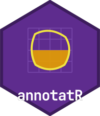

<!-- README.md is generated from README.Rmd. Please edit that file -->

```{r, include = FALSE}
knitr::opts_chunk$set(
  collapse = TRUE,
  comment = "#>",
  fig.path = "man/figures/README-",
  out.width = "100%"
)
```

# annotatR 

<!-- badges: start -->
[](https://github.com/CTTIR/annotatR/actions/workflows/R-CMD-check.yaml)
[](https://cttir.github.io/annotatR/)
[](https://app.codecov.io/gh/CTTIR/annotatR)
[](https://opensource.org/licenses/MIT)
[](https://lifecycle.r-lib.org/articles/stages.html#experimental)
<!-- badges: end -->

**annotatR** provides multi-layer region-of-interest (ROI) annotation for
whole-slide microscopy images, hyperspectral data cubes, and conventional
rasters. Annotations are validated simple-feature geometries stored in image
pixel coordinates with explicit pyramid-level transforms, and rasterise to
binary, labelled, or multi-class integer **masks** for downstream segmentation
and classification. A batch annotation application supports resumable sessions
across image queues, live mask preview, and export to GeoJSON, QuPath, and TIFF.

## Installation

```r
# install.packages("pak")
pak::pak("CTTIR/annotatR")
```

## Quick start

```{r quickstart, message = FALSE}
library(annotatR)

# Read a bundled example image and build a project with one annotation layer.
img <- at_example_image("tissue")
proj <- at_project(img, at_layer("regions", labels = c("tumour", "stroma")))

# Add regions of interest.
proj <- proj |>
  at_add_roi("regions", at_roi_rect(120, 150, 260, 290, label = "tumour")) |>
  at_add_roi("regions", at_roi_circle(400, 120, 60, label = "stroma"))

at_rois(proj)[, c("roi_id", "label", "area_px")]

# Rasterise to a labelled mask (the "Schablone") and write it with a legend.
mask <- at_mask(proj, type = "labelled")
path <- tempfile(fileext = ".tif")
at_write_mask(mask, path)             # also writes <path>.legend.json
```

```{r overlay, message = FALSE, fig.height = 4}
at_plot_overlay(proj)
```

## Supported formats

| Format | Backend | Package required | Pyramid | Spectral |
|---|---|---|---|---|
| PNG / JPEG / TIFF | `raster` | magick or tiff | no | no |
| Pyramidal / OME-TIFF | `tiff` | tiff | yes | multiplex |
| qptiff, OME-TIFF | `ometiff` | RBioFormats | yes | multiplex |
| Cubert `.cu3s` | `cuvis` | cuvis.r + CUVIS SDK | no | yes |
| ENVI cube (BSQ/BIL/BIP) | `envi` | base R, windowed reads | no | yes |
| Diaspective Vision TIVITA | `tivita` | base R, declared profile or sidecar | no | yes |

A TIFF is treated as spectral only when wavelengths are declared. `at_bands()`,
`at_hsi_meta()` and `at_read_stats()` report band wavelengths and gaps, value
units, calibration and transform digests, and the bytes actually read.

## The mask workflow

A **mask** is the central output artifact: a binary, labelled, or multi-class
integer raster derived from your annotations, exportable at any pyramid level
and self-describing via a sidecar JSON legend. Masks feed segmentation,
classification, and spectral-extraction pipelines in Python, ImageJ, QuPath,
or R. See `vignette("masks")` for the pixel-coverage contract and downstream
consumption.

## The annotation app

```r
# Launch the batch annotation app over a queue of images:
at_annotate(at_example_session(5))
```

Iterate through an image queue, draw multi-layer ROIs, watch the mask render
live, and export everything in one pass — with resumable sessions and
keyboard-first throughput. `at_app()` returns the same app as a `shiny.appobj`
for embedding and testing.

## Working with qupflowR

annotatR exchanges annotations with the qupflowR package through a versioned,
hash-inventoried contract. `at_interop_capabilities()` reports which profiles
this installation supports; the file (I0) and R API (I1) profiles are
supported, while direct app control (I2) and embedding (I3) stay *planned*
until they are qualified against a real qupflowR client.

```r
dest <- file.path(tempdir(), "handoff")
receipt <- at_export_qupflowr(proj, dest)            # QuPath GeoJSON, masks, manifest, integrity
report <- at_import_qupflowr(dest)                    # verified, namespaced, never runs analysis
patch <- at_stage_qupflowr(proj, report)              # diff; reviewed ROIs become conflicts
committed <- at_commit_qupflowr(patch, idempotency_key = "review-42")
```

`at_training_export()` writes leakage-free, grouped deep-learning datasets with
integer masks and full provenance, and `at_training_import()` stages model
predictions for review. An optional loopback control service
(`at_control_start()`, protocol `annotatr-control-v1`) lets a partner process
read state and events and send typed commands to a running app. See
`vignette("partner-interop")`.

## Related work

Unlike QuPath, the ImageJ ROI Manager, napari, or Annotorious, annotatR is
R-native and script-first, handles hyperspectral cubes alongside microscopy,
and treats the batch **mask** export as a first-class, reproducible artifact.

## Acknowledgements

annotatR builds on [Shiny](https://shiny.posit.co/), the
[`sf`](https://r-spatial.github.io/sf/) and
[`stars`](https://r-spatial.github.io/stars/) packages.


## Use of LLM tools

Portions of this package were prepared with assistance from large language model tooling for narrowly defined, non-authorial tasks: copyediting, prose smoothing, Markdown/LaTeX formatting, scaffolding of boilerplate files (CI configs, build scripts), code refactoring. The tools used were Chat AI, the LLM service of KISSKI (GWDG), and a self-hosted Mistral Small (24B, Apache-2.0) run locally via Ollama and the ollamar R package — local inference only, with no data sent to third parties for the self-hosted model.
