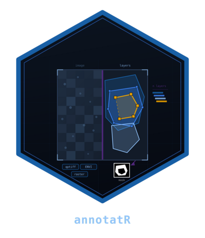

# Get started with annotatR



annotatR helps you draw, organise and export regions of interest (ROIs)
across ordinary images, whole-slide microscopy and hyperspectral data
cubes. Every annotation is stored as a validated simple-feature geometry
in image pixel coordinates, so it survives round-trips to GeoJSON,
QuPath and TIFF, and can be rasterised into the integer masks that
downstream segmentation and classification pipelines expect.

This vignette is a five-minute, end-to-end tour. We begin from a bundled
example image, build a small project, add a couple of regions, inspect
them as a table and as a plot, summarise them, and finish by writing a
labelled mask to disk. Everything here uses only the data that ships
with the package, so you can run it verbatim; nothing touches the
network, and the single file we write goes to a temporary directory.
Function names share the `at_` prefix, which makes the API easy to
explore by tab-completion once you have the broad shape in mind.

## An example image

The package bundles three small example assets, reachable through
[`at_example_image()`](https://cttir.github.io/annotatR/reference/at_example_image.md):
a `"tissue"` RGB raster, a four-channel `"multiplex"` pyramid, and a
40-band spectral `"cube"`. We will use the tissue image throughout.

``` r

img <- at_example_image("tissue")
img
#> <annot_image> example_tissue.png
#> backend: "raster"  |  dtype: "uint8"
#> size: 512 x 512 px  |  levels: 1  |  bands: 3
#> pixel size: 1 x 1 px
```

An `annot_image` is a thin, lazy handle over a pluggable backend rather
than the pixels themselves. A handful of accessors tell you what you are
working with:

``` r

at_dims(img)
#> [1] 512 512
at_n_bands(img)
#> [1] 3
at_is_spectral(img)
#> [1] FALSE
at_bands(img)
#> # A tibble: 3 × 4
#>   index name  wavelength unit 
#>   <int> <chr>      <dbl> <chr>
#> 1     1 R             NA NA   
#> 2     2 G             NA NA   
#> 3     3 B             NA NA
```

This is an ordinary 512 by 512 RGB image with three bands and no
spectral axis. A multiplex or cube image would report several bands,
wavelengths and, often, multiple pyramid levels; the accessors above are
the same regardless, which is what lets one annotation workflow span
very different data. Coordinates follow the image convention used
everywhere in annotatR: the origin sits at the top-left corner, `y`
increases downward, and pixel `(i, j)` has its centre at
`(j - 0.5, i - 0.5)`. Keeping that in mind makes every ROI you draw land
exactly where you expect.

## Building a project

A *layer* groups ROIs that share a purpose and a controlled set of
labels; a *project* pairs an image with one or more layers plus
provenance. We create an empty layer and hand it to
[`at_project()`](https://cttir.github.io/annotatR/reference/at_project.md).

``` r

regions <- at_layer("regions", labels = c("tumour", "immune"))
project <- at_project(img, regions, name = "quick tour")
project
#> <annot_project> quick tour
#> image: "example_tissue.png"
#> layers: 1  |  ROIs: 0
#>   regions: 0 ROIs, labels "tumour" and "immune"
```

Every project mutator is pure: it returns a modified copy and never
alters its input, which makes annotation pipelines safe to compose and
easy to reason about.

## Adding some regions

Now we draw two ROIs and attach each to the `regions` layer with
[`at_add_roi()`](https://cttir.github.io/annotatR/reference/at_add_roi.md).
A rectangle is given by its corners, a circle by a centre and radius;
both accept a `label` drawn from the layer’s vocabulary. The native pipe
keeps the flow readable.

``` r

project <- project |>
  at_add_roi("regions", at_roi_rect(120, 150, 260, 290, label = "tumour")) |>
  at_add_roi("regions", at_roi_circle(400, 400, 60, label = "immune"))
project
#> <annot_project> quick tour
#> image: "example_tissue.png"
#> layers: 1  |  ROIs: 2
#>   regions: 2 ROIs, labels "tumour" and "immune"
```

Each addition is recorded in the project’s edit log, so the provenance
of the finished annotation set is always available.

## Inspecting the annotations

[`at_rois()`](https://cttir.github.io/annotatR/reference/at_rois.md)
returns a tidy tibble with one row per ROI. Geometry, area and centroid
are reported at pyramid level 0, and the table carries an `sf` geometry
column; here we drop it to focus on the attributes.

``` r

roi_tbl <- at_rois(project)
sf::st_drop_geometry(roi_tbl)[, c("roi_id", "layer", "label", "geom_type",
                                  "level", "area_px", "n_vertices")]
#> # A tibble: 2 × 7
#>   roi_id        layer   label  geom_type level area_px n_vertices
#>   <chr>         <chr>   <chr>  <chr>     <int>   <dbl>      <int>
#> 1 roi_000000001 regions tumour POLYGON       0  19600           5
#> 2 roi_000000002 regions immune POLYGON       0  11292.         65
```

Notice that the circle has been stored as a many-vertex polygon:
annotatR keeps every ROI as a genuine simple feature, so areas, overlaps
and set operations are all exact.
[`at_rois()`](https://cttir.github.io/annotatR/reference/at_rois.md)
also accepts `layer` and `label` arguments when you want to pull out a
subset, and
[`at_summary()`](https://cttir.github.io/annotatR/reference/at_summary.md)
rolls the same table up into per-label counts and areas — a quick sanity
check before you commit to a mask.

``` r

at_summary(project)
#> <annot_summary> quick tour
#> layers: 1  |  ROIs: 2
#>   "immune": 1 ROI, area 11291.6 px
#>   "tumour": 1 ROI, area 19600 px
```

## Seeing them in context

[`at_plot_overlay()`](https://cttir.github.io/annotatR/reference/at_plot_overlay.md)
draws the ROI outlines on top of the image and returns a `ggplot`
object. Referencing it on its own line renders the figure.

``` r

at_plot_overlay(project)
```


## Rasterising to a mask

The core deliverable is a *mask*: an integer raster that segmentation
and classification code can consume directly.
[`at_mask()`](https://cttir.github.io/annotatR/reference/at_mask.md)
offers three flavours — a `"binary"` foreground mask, a `"labelled"`
mask with one value per ROI, and a `"multiclass"` mask with one value
per label class. We build a labelled mask.

``` r

m <- at_mask(project, type = "labelled")
m
#> <annot_mask> labelled  |  512 x 512 px  |  level 0
#> values: 2
#> # A tibble: 2 × 6
#>   value label  layer   roi_id         n_px colour 
#>   <int> <chr>  <chr>   <chr>         <int> <chr>  
#> 1     1 tumour regions roi_000000001 19600 #999999
#> 2     2 immune regions roi_000000002 11296 #E69F00
```

A pixel is filled when its centre lies inside the polygon (the default,
`touches = FALSE`), using a half-open tie rule so that shared edges are
never double-counted; set `touches = TRUE` if you would rather include
any pixel the polygon so much as grazes. Where ROIs overlap, the
`overlap` argument decides who wins — by default the region drawn last,
but `"first"`, `"max"`, `"min"` and `"error"` are all available. The
mask carries a self-describing legend, and because it is a plain integer
matrix underneath you can tabulate it directly.

``` r

at_mask_legend(m)
#> # A tibble: 2 × 6
#>   value label  layer   roi_id         n_px colour 
#>   <int> <chr>  <chr>   <chr>         <int> <chr>  
#> 1     1 tumour regions roi_000000001 19600 #999999
#> 2     2 immune regions roi_000000002 11296 #E69F00
table(as.integer(m))
#> 
#>      0      1      2 
#> 231248  19600  11296
```

## Writing the mask to disk

Finally we write the mask out.
[`at_write_mask()`](https://cttir.github.io/annotatR/reference/at_write_mask.md)
defaults to a 16-bit TIFF and, alongside it, a sidecar
`<path>.legend.json` that records the value-to-label mapping, pyramid
level and dimensions — so the file is never a bag of anonymous integers.
We write to a temporary directory.

``` r

out_path <- file.path(tempdir(), "quick_tour_mask.tiff")
at_write_mask(m, out_path, overwrite = TRUE)
list.files(tempdir(), pattern = "quick_tour_mask")
#> [1] "quick_tour_mask.tiff"             "quick_tour_mask.tiff.legend.json"
```

Both the raster and its legend appear, ready to hand to the next stage
of your pipeline (or to reload with
[`at_read_mask()`](https://cttir.github.io/annotatR/reference/at_read_mask.md)).

That is the whole loop: read, annotate, inspect, rasterise, export. From
here, the **Images and backends** vignette explains how annotatR reads
pyramids and spectral cubes, and how to register a backend of your own.

## Use of LLM tools

Portions of this package were prepared with assistance from large
language model tooling for narrowly defined, non-authorial tasks:
copyediting, prose smoothing, Markdown/LaTeX formatting, scaffolding of
boilerplate files (CI configs, build scripts), code refactoring. The
tools used were Chat AI, the LLM service of KISSKI (GWDG), and a
self-hosted Mistral Small (24B, Apache-2.0) run locally via Ollama and
the ollamar R package — local inference only, with no data sent to third
parties for the self-hosted model.
