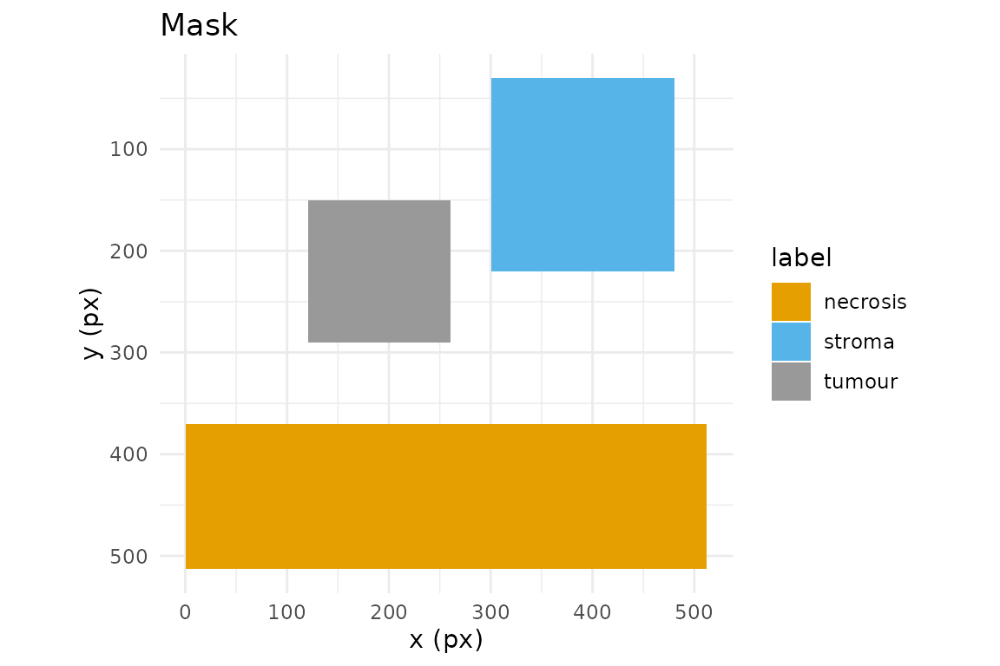

# Masks


A *mask* is the artefact that turns hand-drawn regions into something a
segmentation or classification pipeline can consume: an integer raster
on the same pixel grid as the image, where each pixel carries the
identity of the region it belongs to. In annotatR the mask is the core
deliverable, and
[`at_mask()`](https://cttir.github.io/annotatR/reference/at_mask.md) is
the function that produces it from an `annot_roi`, an `annot_layer`, or
a whole `annot_project`.

## Three mask types

[`at_mask()`](https://cttir.github.io/annotatR/reference/at_mask.md)
writes one of three rasters, chosen with `type`:

- **`"binary"`** — a logical matrix: `TRUE` wherever *any* region covers
  a pixel, `FALSE` elsewhere. Use it for foreground/background problems
  (“is this pixel annotated at all?”).
- **`"labelled"`** — one distinct positive integer per ROI, assigned in
  draw order. Use it when individual objects must stay separable,
  e.g. instance segmentation where two adjacent tumour nests are
  different things.
- **`"multiclass"`** — one integer per *label class*, so every ROI
  sharing a label collapses to the same value. Use it for semantic
  segmentation, where you care about the class (“tumour”, “stroma”) and
  not the particular ROI.

Every mask is an `annot_mask`: a matrix with an attached `legend` tibble
(`value`, `label`, `layer`, `roi_id`, `n_px`, `colour`) plus `level`,
`dims`, and `mask_type` attributes. Read the legend back with
[`at_mask_legend()`](https://cttir.github.io/annotatR/reference/at_mask_legend.md).

## The pixel-coverage contract

Rasterisation is only reproducible if the pixel/geometry relationship is
exact, so annotatR pins it down. Pixel `(i, j)` covers the half-open
square `[j-1, j) x [i-1, i)`, with `(0, 0)` at the top-left corner of
the top-left pixel; its centre is therefore `(j - 0.5, i - 0.5)`. With
the default `touches = FALSE`, a pixel is in the mask when *its centre*
lies inside the polygon, using a half-open `[lower, upper)` tie rule: a
centre on the lower edge counts as inside, one on the upper edge as
outside.

The cleanest way to trust this is to compute a small case by eye. Take a
rectangle from `(2, 2)` to `(5, 5)` on a 10x10 grid:

``` r

r <- at_roi_rect(2, 2, 5, 5, label = "a")
m <- at_mask(r, "binary", dims = c(10, 10))
print(matrix(as.integer(m), 10, 10))
#>       [,1] [,2] [,3] [,4] [,5] [,6] [,7] [,8] [,9] [,10]
#>  [1,]    0    0    0    0    0    0    0    0    0     0
#>  [2,]    0    0    0    0    0    0    0    0    0     0
#>  [3,]    0    0    1    1    1    0    0    0    0     0
#>  [4,]    0    0    1    1    1    0    0    0    0     0
#>  [5,]    0    0    1    1    1    0    0    0    0     0
#>  [6,]    0    0    0    0    0    0    0    0    0     0
#>  [7,]    0    0    0    0    0    0    0    0    0     0
#>  [8,]    0    0    0    0    0    0    0    0    0     0
#>  [9,]    0    0    0    0    0    0    0    0    0     0
#> [10,]    0    0    0    0    0    0    0    0    0     0
```

Rows and columns 3, 4 and 5 are set, and nothing else. The rectangle
spans `x` in `[2, 5)`; the pixel-centre x-coordinates that fall in that
interval are `2.5, 3.5, 4.5`, i.e. columns 3, 4, 5. The centre at
`x = 5.5` (column 6) is outside, and the lower edge at `x = 2` is inside
because centre `2.5 > 2`. The same reasoning on `y` gives rows 3:5. A
four-pixel-wide rectangle covers exactly nine pixels — no fencepost
surprises.

## `touches`: centres versus contact

`touches = TRUE` switches to a “does the polygon touch the pixel at all”
rule (GDAL `ALL_TOUCHED=TRUE`), which grows the region by the fringe
pixels a polygon merely clips. It matters when edges cut through pixel
interiors rather than running along the grid. A rectangle with
fractional bounds shows the contrast:

``` r

r2  <- at_roi_rect(2.5, 2.5, 4.5, 4.5, label = "a")
off <- matrix(as.integer(at_mask(r2, "binary", dims = c(8, 8), touches = FALSE)), 8, 8)
on  <- matrix(as.integer(at_mask(r2, "binary", dims = c(8, 8), touches = TRUE)),  8, 8)
off
#>      [,1] [,2] [,3] [,4] [,5] [,6] [,7] [,8]
#> [1,]    0    0    0    0    0    0    0    0
#> [2,]    0    0    0    0    0    0    0    0
#> [3,]    0    0    1    1    0    0    0    0
#> [4,]    0    0    1    1    0    0    0    0
#> [5,]    0    0    0    0    0    0    0    0
#> [6,]    0    0    0    0    0    0    0    0
#> [7,]    0    0    0    0    0    0    0    0
#> [8,]    0    0    0    0    0    0    0    0
on
#>      [,1] [,2] [,3] [,4] [,5] [,6] [,7] [,8]
#> [1,]    0    0    0    0    0    0    0    0
#> [2,]    0    0    0    0    0    0    0    0
#> [3,]    0    0    1    1    1    0    0    0
#> [4,]    0    0    1    1    1    0    0    0
#> [5,]    0    0    1    1    1    0    0    0
#> [6,]    0    0    0    0    0    0    0    0
#> [7,]    0    0    0    0    0    0    0    0
#> [8,]    0    0    0    0    0    0    0    0
```

With `touches = FALSE` only the pixels whose centres sit inside the
rectangle are kept; with `touches = TRUE` the partially clipped border
pixels join too. Prefer the default for area-faithful masks, and
`touches = TRUE` only when you must not drop thin structures.

## Overlap resolution

When two regions cover the same pixel, `overlap` decides who wins. The
ROIs are rasterised in draw order (ascending `z`, then insertion):

``` r

lyr <- at_layer("regions")
lyr <- at_layer_add(lyr, at_roi_rect(1, 1, 5, 5, label = "a"))
lyr <- at_layer_add(lyr, at_roi_rect(3, 3, 7, 7, label = "b"))
matrix(as.integer(at_mask(lyr, "labelled", dims = c(8, 8), overlap = "last")),  8, 8)
#>      [,1] [,2] [,3] [,4] [,5] [,6] [,7] [,8]
#> [1,]    0    0    0    0    0    0    0    0
#> [2,]    0    1    1    1    1    0    0    0
#> [3,]    0    1    1    1    1    0    0    0
#> [4,]    0    1    1    2    2    2    2    0
#> [5,]    0    1    1    2    2    2    2    0
#> [6,]    0    0    0    2    2    2    2    0
#> [7,]    0    0    0    2    2    2    2    0
#> [8,]    0    0    0    0    0    0    0    0
matrix(as.integer(at_mask(lyr, "labelled", dims = c(8, 8), overlap = "first")), 8, 8)
#>      [,1] [,2] [,3] [,4] [,5] [,6] [,7] [,8]
#> [1,]    0    0    0    0    0    0    0    0
#> [2,]    0    1    1    1    1    0    0    0
#> [3,]    0    1    1    1    1    0    0    0
#> [4,]    0    1    1    1    1    2    2    0
#> [5,]    0    1    1    1    1    2    2    0
#> [6,]    0    0    0    2    2    2    2    0
#> [7,]    0    0    0    2    2    2    2    0
#> [8,]    0    0    0    0    0    0    0    0
```

`"last"` (the default) lets the later-drawn region overwrite; `"first"`
keeps the earlier one; `"max"` and `"min"` resolve by pixel value; and
`"error"` aborts the moment any two regions collide, which is the safest
choice when overlaps should never happen.

## Masks from a project

On a real project the mask spans the image grid. The bundled example
carries one layer of three labelled regions:

``` r

proj <- at_example_project()
mc <- at_mask(proj, type = "multiclass")
mc
#> <annot_mask> multiclass  |  512 x 512 px  |  level 0
#> values: 3
#> # A tibble: 3 × 6
#>   value label    layer   roi_id  n_px colour 
#>   <int> <chr>    <chr>   <chr>  <int> <chr>  
#> 1     1 tumour   regions NA     19600 #999999
#> 2     2 necrosis regions NA     72704 #E69F00
#> 3     3 stroma   regions NA     34200 #56B4E9
at_mask_legend(mc)
#> # A tibble: 3 × 6
#>   value label    layer   roi_id  n_px colour 
#>   <int> <chr>    <chr>   <chr>  <int> <chr>  
#> 1     1 tumour   regions NA     19600 #999999
#> 2     2 necrosis regions NA     72704 #E69F00
#> 3     3 stroma   regions NA     34200 #56B4E9
table(as.integer(mc))
#> 
#>      0      1      2      3 
#> 135640  19600  72704  34200
```

[`at_mask_stats()`](https://cttir.github.io/annotatR/reference/at_mask_stats.md)
summarises each value — pixel counts, area, fraction of the frame,
bounding box and centroid — ready for a report table:

``` r

at_mask_stats(mc)
#> # A tibble: 3 × 12
#>   value label     n_px area_px area_physical frac_total bbox_xmin bbox_ymin
#>   <int> <chr>    <int>   <dbl>         <dbl>      <dbl>     <dbl>     <dbl>
#> 1     1 tumour   19600   19600            NA     0.0748       120       150
#> 2     2 necrosis 72704   72704            NA     0.277          0       370
#> 3     3 stroma   34200   34200            NA     0.130        300        30
#> # ℹ 4 more variables: bbox_xmax <dbl>, bbox_ymax <dbl>, centroid_x <dbl>,
#> #   centroid_y <dbl>
```

## Writing masks and the legend sidecar

[`at_write_mask()`](https://cttir.github.io/annotatR/reference/at_write_mask.md)
writes an integer TIFF (16-bit by default), and — because a bare integer
raster is meaningless without a key — a companion `<path>.legend.json`
describing it:

``` r

dir  <- tempfile("masks-"); dir.create(dir)
path <- file.path(dir, "regions.tif")
at_write_mask(mc, path, overwrite = TRUE)
list.files(dir)
#> [1] "regions.tif"             "regions.tif.legend.json"
cat(readLines(paste0(path, ".legend.json")), sep = "\n")
#> {
#>   "annotatR_version": "0.0.1",
#>   "created": "2026-07-22T07:41:13+0000",
#>   "mask_type": "multiclass",
#>   "level": 0,
#>   "dims": [512, 512],
#>   "source_project": "example",
#>   "legend": [
#>     {
#>       "value": 1,
#>       "label": "tumour",
#>       "layer": "regions",
#>       "roi_id": null,
#>       "n_px": 19600,
#>       "colour": "#999999"
#>     },
#>     {
#>       "value": 2,
#>       "label": "necrosis",
#>       "layer": "regions",
#>       "roi_id": null,
#>       "n_px": 72704,
#>       "colour": "#E69F00"
#>     },
#>     {
#>       "value": 3,
#>       "label": "stroma",
#>       "layer": "regions",
#>       "roi_id": null,
#>       "n_px": 34200,
#>       "colour": "#56B4E9"
#>     }
#>   ]
#> }
```

The schema is self-describing: `annotatR_version`, the `created`
timestamp, the `mask_type`, the pyramid `level`, the raster `dims`, the
`source_project`, and the full `legend` array (one object per value,
mirroring the legend tibble). Any consumer can map pixel values back to
labels without touching R.

## Downstream consumption

A Python pipeline reads the TIFF and its legend directly — no R runtime,
no bespoke format:

``` python
import json
import tifffile

mask = tifffile.imread("regions.tif")            # integer array, image grid
with open("regions.tif.legend.json") as f:
    legend = json.load(f)

value_to_label = {row["value"]: row["label"] for row in legend["legend"]}
tumour = mask == next(v for v, l in value_to_label.items() if l == "tumour")
```

## Reading masks back

Masks are not a dead end.
[`at_read_mask()`](https://cttir.github.io/annotatR/reference/at_read_mask.md)
polygonises an existing mask — annotatR’s own output, or a
Cellpose/StarDist/QuPath raster — back into an editable `annot_layer`,
recovering labels from the sidecar when it is present:

``` r

back <- at_read_mask(path)
vapply(back$rois, function(r) r$label, character(1))
#> [1] "necrosis" "tumour"   "stroma"
```

Finally,
[`at_plot_mask()`](https://cttir.github.io/annotatR/reference/at_plot_mask.md)
renders a mask with its legend for a quick visual check:

``` r

at_plot_mask(mc)
```



Next, see the **Interoperability** vignette for GeoJSON, QuPath, and CSV
exchange with other tools.

## Use of LLM tools

Portions of this package were prepared with assistance from large
language model tooling for narrowly defined, non-authorial tasks:
copyediting, prose smoothing, Markdown/LaTeX formatting, scaffolding of
boilerplate files (CI configs, build scripts), code refactoring. The
tools used were Chat AI, the LLM service of KISSKI (GWDG), and a
self-hosted Mistral Small (24B, Apache-2.0) run locally via Ollama and
the ollamar R package — local inference only, with no data sent to third
parties for the self-hosted model.
