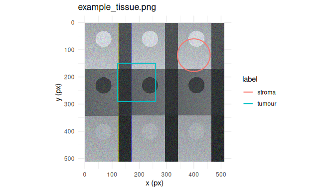

# annotatR

**annotatR** provides multi-layer region-of-interest (ROI) annotation
for whole-slide microscopy images, hyperspectral data cubes, and
conventional rasters. Annotations are validated simple-feature
geometries stored in image pixel coordinates with explicit pyramid-level
transforms, and rasterise to binary, labelled, or multi-class integer
**masks** for downstream segmentation and classification. A batch
annotation application supports resumable sessions across image queues,
live mask preview, and export to GeoJSON, QuPath, and TIFF.

## Installation

``` r

# install.packages("pak")
pak::pak("CTTIR/annotatR")
```

## Quick start

``` r

library(annotatR)

# Read a bundled example image and build a project with one annotation layer.
img <- at_example_image("tissue")
proj <- at_project(img, at_layer("regions", labels = c("tumour", "stroma")))

# Add regions of interest.
proj <- proj |>
  at_add_roi("regions", at_roi_rect(120, 150, 260, 290, label = "tumour")) |>
  at_add_roi("regions", at_roi_circle(400, 120, 60, label = "stroma"))

at_rois(proj)[, c("roi_id", "label", "area_px")]
#> # A tibble: 2 × 3
#>   roi_id        label  area_px
#>   <chr>         <chr>    <dbl>
#> 1 roi_000000001 tumour  19600 
#> 2 roi_000000002 stroma  11292.

# Rasterise to a labelled mask (the "Schablone") and write it with a legend.
mask <- at_mask(proj, type = "labelled")
path <- tempfile(fileext = ".tif")
at_write_mask(mask, path)             # also writes <path>.legend.json
```

``` r

at_plot_overlay(proj)
```



## Supported formats

| Format                    | Backend   | Package required | Pyramid | Spectral  |
|---------------------------|-----------|------------------|---------|-----------|
| PNG / JPEG / TIFF         | `raster`  | magick or tiff   | no      | no        |
| Pyramidal / OME-TIFF      | `tiff`    | tiff             | yes     | multiplex |
| qptiff, OME-TIFF          | `ometiff` | RBioFormats      | yes     | multiplex |
| Cubert `.cu3`             | `cuvis`   | cuvis.r          | no      | yes       |
| ENVI cube                 | `envi`    | base R           | no      | yes       |
| Diaspective Vision Tivita | `tivita`  | base R (ENVI)    | no      | yes       |

## The mask workflow

A **mask** is the central output artifact: a binary, labelled, or
multi-class integer raster derived from your annotations, exportable at
any pyramid level and self-describing via a sidecar JSON legend. Masks
feed segmentation, classification, and spectral-extraction pipelines in
Python, ImageJ, QuPath, or R. See
[`vignette("masks")`](https://cttir.github.io/annotatR/articles/masks.md)
for the pixel-coverage contract and downstream consumption.

## The annotation app

``` r

# Launch the batch annotation app over a queue of images:
at_annotate(at_example_session(5))
```

Iterate through an image queue, draw multi-layer ROIs, watch the mask
render live, and export everything in one pass — with resumable sessions
and keyboard-first throughput.

## Related work

Unlike QuPath, the ImageJ ROI Manager, napari, or Annotorious, annotatR
is R-native and script-first, handles hyperspectral cubes alongside
microscopy, and treats the batch **mask** export as a first-class,
reproducible artifact.

## Acknowledgements

annotatR builds on [OpenSeadragon](https://openseadragon.github.io/),
[Annotorious](https://annotorious.github.io/), and the
[`sf`](https://r-spatial.github.io/sf/) and
[`stars`](https://r-spatial.github.io/stars/) packages.
