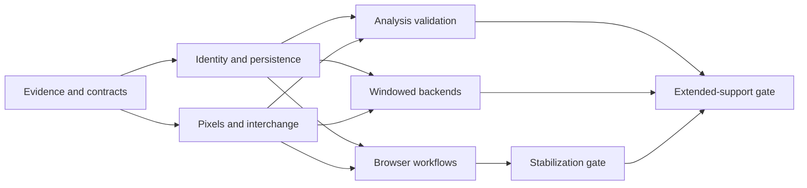

# annotatR improvement roadmap

Prepared 2026-09-10 against `f69bf201f651c845ab496f76e25638bc919d4b13` (package version 0.1.0).

The first objective is dependable annotation and export: an action must affect the intended image, saved work must survive restart, and masks must preserve the documented pixel grid. The next objectives are trustworthy quantitative analysis and bounded memory use for large images. Keep the existing R object model and public workflows while correcting their contracts incrementally.

This is a proposed execution plan. No runtime fixes have been implemented by creating it. All work packages below are **Not Started**. The planning documents and historical evidence archive are available now.

Companion documents:

- [Project analysis and complete finding register](ANALYSIS.md).
- [Validation strategy, fixtures, benchmarks, and release gates](VALIDATION.md).
- [Historical audit and runnable diagnostics](evidence/2026-09-10/README.md).

## Planning assumptions

Prioritize correctness and data integrity. “Analysis” includes both the quality of the project assessment and the reliability of mask, spectrum, extraction, and agreement outputs. There is no supplied deadline, capacity allocation, representative performance hardware, or named implementation owner.

Effort estimates are focused engineering days, including implementation, regression tests, documentation, and review. They assume one primary maintainer familiar with R/Shiny. They are planning ranges, not calendar commitments. Maintainer, backend specialist, analysis reviewer, and release owner are responsibilities; one person may fill several, and the actual assignees remain open. Access to optional-format fixtures is an external dependency.

Do not expand formats or redesign the whole UI during stabilization. Preserve existing IDs and valid saved annotations where possible. Any change that cannot read existing valid files needs an explicit migration and a versioned compatibility decision.

## Milestones and estimates

| Milestone | Horizon | Outcome | Work packages | Effort | Dependencies and exit condition |
|---|---|---|---|---:|---|
| M0: establish evidence | Now | Findings become repeatable, reviewable regression specifications | T00 | 2–3 days | No dependency; scenarios and independent expected results recorded |
| M1: preserve work and image identity | Now | Saving, navigation, history, cache, and queue identity agree | T01–T03 | 6–10 days | M0; no cross-image mutation or lost committed work in transition tests |
| M2: preserve pixels and interchange | Now | Masks, coordinates, readers, and exports obey one contract | T04–T09 | 7–12 days | M0; T01 for output naming and source identity; exact integer fixtures and transform tests pass |
| M3: make the app dependable | Next | Browser behavior matches saved geometries and available capabilities | T10–T11 | 4–7 days | M1 and relevant M2 contracts; real-browser journeys pass |
| M4: validate analytical outputs | Next | Counts, spectra, comparisons, and provenance support reproducible analysis | T12–T14 | 4–7 days | M1–M2; independent analytical fixtures and reporting contracts pass |
| M5: support large data deliberately | Later | Supported backends read windows; queues and exports have bounded working memory | T15–T17 | 10–18 days | Source descriptors from M1, correctness oracles from M2, benchmark specification from M0 |
| M6: qualify and release | At each release boundary | Published support claims match tested behavior | T18 | 3–5 days total | Stabilization and extended-support gates in VALIDATION.md |

Total: **36–62 focused days**, or approximately **45–78 with a 25% uncertainty allowance**. This is not a promise to complete all work in one quarter. Re-estimate after M0 and after the first real backend benchmark. Estimates do not include waiting for proprietary fixtures or changes in the shared CI repository.

The stabilization subset M0–M3 plus release qualification is approximately **22–37 focused days** before allowance. M4 and M5 may continue after that release; neither should delay a correct fix for existing data-loss behavior.

The diagram describes technical dependencies. It does not assume multiple implementers or overlapping capacity.

## Work packages

### T00 — Preserve evidence and turn findings into regressions

**Owner:** maintainer. **Effort:** 2–3 days. **Dependencies:** none. **Milestone:** M0. **Finding coverage:** A01–A25.

Promote the archived diagnostic cases into focused assertions in the existing test structure. Record the audited revision, dependency versions, expected behavior, actual behavior, and observation method. Use synthetic files and independent expected matrices. Split A14 into numeric-choice and connectivity cases; split A24 into hole hit-testing and broader geometry display cases. Keep all audit IDs stable.

**Acceptance:** each finding has an executable regression or a documented external test prerequisite, a proposed contract, and an owner. Passing printed diagnostics are never counted as passing correctness tests. Establish a supported-format test inventory and a benchmark fixture inventory without copying the ignored local workbench into the package.

### T01 — Introduce stable queue, ROI, and source identity

**Owner:** maintainer. **Effort:** 2–3 days. **Dependencies:** T00. **Milestone:** M1. **Findings:** A07, A08, A09.

Give each queue entry an immutable persisted identifier, separate from its display name and source path. Keep distinct entries distinguishable even when they refer to the same file. Use safe unique export stems derived from entry identity. Canonicalize image sources and associate cache entries with a source/read generation and reader options. Generate new ROI IDs until unique across the project; validate populated layer insertion as well as individual ROI insertion.

**Acceptance:** duplicate basenames, case differences, relative paths from different directories, repeated source entries, reloaded projects, and replacement files never alias annotations or cached pixels. Existing noncolliding ROI IDs remain unchanged. Export receipts identify every queue entry unambiguously.

### T02 — Centralize annotation and navigation transitions

**Owner:** maintainer. **Effort:** 2–4 days. **Dependencies:** T01. **Milestone:** M1. **Findings:** A02, A03, A04, A11, A12.

Route drawing, editing, deletion, history, queue navigation, and keyboard actions through shared transition functions. Each action carries the intended queue-entry identity and expected revision. Keep a bounded history per entry containing annotation state rather than complete pixel arrays. Snapshot live edits into the in-memory session before navigation, independently of disk autosave. Use an explicit session-generation signal when replacing a queue; avoid observing every session mutation, which could trigger reload/save cycles.

**Acceptance:** Shift+Enter commits the original entry before advancing; failed commits do not advance. Undo/Redo mark the correct entry dirty and cannot restore another image. Replacing a queue at cursor 1 refreshes the image. Stale browser events from a previous image are rejected. All cases pass with autosave on and off.

### T03 — Make save and resume an explicit persistence contract

**Owner:** maintainer. **Effort:** 2–3 days. **Dependencies:** T01; integrate with T02. **Milestone:** M1. **Findings:** A01, A23.

Persist a versioned source descriptor containing backend, source location, and serializable reader options needed to reopen the image. Treat pixel handles as reconstructible runtime state. Implement one reopen/materialization path for package and app use, with an actionable missing-source outcome. Resolve the default save path before overwrite checks. Stage writes on the destination filesystem, check successful replacement, and retain the previous valid checkpoint on failure. For a multi-file checkpoint, publish the manifest only after referenced files are complete.

**Acceptance:** a fresh R process can resume standard raster and spectral sessions, display images, extract the same values, and continue editing. Explicit/default overwrite behavior agrees. An injected write failure never displays “saved,” loses the last valid checkpoint, or marks an uncommitted entry complete. Verify replacement behavior on Windows as well as Unix-like platforms.

### T04 — Unify mask membership and extraction bounds

**Owner:** maintainer. **Effort:** 1–2 days. **Dependencies:** T00. **Milestone:** M2. **Findings:** A05, A15.

Restrict the rectangle optimization to geometries proven to be rectangles, falling back for other polygons. Define membership for points, polygon boundaries, holes, and thin geometries. Derive extraction bounds from the same grid convention. Establish independent expected results before optimizing additional cases.

**Acceptance:** adding a disjoint ROI cannot change another ROI's binary support. Optimized/general rasterization and selected engines agree on supported cases. Integer-coordinate points yield the same pixels in masks and extraction. The audit's 25-versus-13 triangle discrepancy is resolved against an independent oracle, not by assuming one existing path is authoritative.

### T05 — Use explicit coordinate levels at every boundary

**Owner:** maintainer. **Effort:** 2–3 days. **Dependencies:** T04. **Milestone:** M2. **Findings:** A06, A16, A18, A21.

Consolidate transforms using actual image level dimensions, including anisotropic and non-power-of-two pyramids. Retain the existing ability to store ROIs at a declared level; normalize at computational/export boundaries rather than silently rewriting all existing geometries. Write the level matching exported coordinates, with original level retained separately only as provenance. Preserve image coordinates when downsampling plots. Boolean operations must normalize with sufficient metadata or reject ambiguous mixed levels.

**Acceptance:** integer masks survive supported round trips exactly; geometry round trips meet the declared numerical tolerance. Per-ROI exports match project selections. Plot coordinates align at every tested display level. Ambiguous legacy exports receive a documented import mode rather than guessed correction.

### T06 — Version mask encoding and preserve its metadata

**Owner:** maintainer with analysis reviewer. **Effort:** 2–3 days. **Dependencies:** T04–T05. **Milestone:** M2. **Findings:** A17, A19, A20.

Make background, categorical/instance/bitfield encoding, label-code mapping, level, dimensions, overlap policy, and source identity explicit mask metadata. Reject foreground/background collisions. Recover embedded RDS metadata before sidecars; document explicit override precedence. Share membership-aware logic across legends, statistics, previews, derived masks, and display. Treat ordinary categorical values differently from bit combinations.

**Acceptance:** a label survives RDS import; empty masks retain valid metadata; bitfield class counts include overlap while categorical counts remain exclusive. Legend counts equal independently computed statistics. Legacy masks with insufficient encoding metadata are flagged or handled by an explicit documented default.

### T07 — Validate binary readers before allocating or reshaping

**Owner:** maintainer. **Effort:** 1–2 days. **Dependencies:** T00. **Milestone:** M2. **Findings:** A10, A13.

Parse ENVI header offsets, validate dimensions/types/interleaves/endian declarations, seek correctly, and verify payload lengths. Apply corresponding validation to NPY headers, versions, dimensions, and integer ranges. Reject unsupported 64-bit values that cannot be represented instead of retaining only low words. Use overflow-safe expected-size arithmetic and resource bounds before allocation.

**Acceptance:** independent BSQ/BIL/BIP and C/Fortran fixtures decode exactly; short payloads always error before recycling; valid offset payloads exclude sentinel headers; unsupported encodings fail explicitly. Extra bytes are handled according to the format contract, not a blanket size-equality rule.

### T08 — Fix numeric option handling and connectivity

**Owner:** maintainer. **Effort:** 0.5–1 day. **Dependencies:** T00; T04 for membership fixtures. **Milestone:** M2. **Finding:** A14.

Support numeric choice arguments without weakening string validation. Pass requested connectivity to the actual polygonization implementation, verifying the supported API locally. Check `bits`, `connectivity`, and other callers for explicit default versus omitted default behavior.

**Acceptance:** `bits=8L`, `bits=16L`, `connectivity=4L`, and `connectivity=8L` work as documented. Diagonal components distinguish the two connectivity modes. Invalid, missing, fractional, and out-of-range arguments produce useful errors.

### T09 — Constrain output paths and expose complete export outcomes

**Owner:** maintainer. **Effort:** 0.5–1 day. **Dependencies:** T01. **Milestone:** M2. **Finding:** A22; reinforces A08.

Create one filename policy for package and app exports. Preserve user-visible labels in metadata while using safe path components. Preflight destination containment, aliases, and collisions, including existing symlinked directories where supported. Stage outputs and sidecars so receipts report complete, failed, and skipped items accurately.

**Acceptance:** names containing separators or `..` cannot escape the destination; duplicate stems remain unique; an incomplete export cannot report success; one failed item does not hide the receipt for other items.

### T10 — Render and route all supported widget geometry correctly

**Owner:** maintainer. **Effort:** 2–3 days. **Dependencies:** T02, T04–T06. **Milestone:** M3. **Findings:** A24, A25.

Render polygon interiors and holes consistently with hit-testing; cover MultiPolygon and other declared supported types. Use a single global message dispatcher with a registry of live widget instances and disposal cleanup. Attach entry/revision identity to drawing events and preserve ROI identity and attributes during edits.

**Acceptance:** hole clicks do not select/delete the surrounding polygon; multipolygons display and edit correctly; two simultaneous widgets accept independent proxy commands; remounting does not accumulate handlers. Verify these in a real browser as well as focused JavaScript tests.

### T11 — Make app capabilities and saved state clear

**Owner:** maintainer, with a user workflow reviewer. **Effort:** 2–4 days. **Dependencies:** T02–T03, T10. **Milestone:** M3. **Evidence:** O02, O04 and workflow review.

Handle missing display dependencies and failed image decoding explicitly. Respect documented layer visibility, locking, color, and z-order through server mutation rules and display. Show the current image and save state consistently. Complete keyboard journeys, cancellation of unfinished drawings, focus handling, error recovery, and queue replacement behavior. Reconcile product documentation with the actual canvas implementation.

**Acceptance:** supported minimal installations either show an image or explain the missing capability before editing. Locked annotations cannot be changed through alternate controls. A keyboard-only workflow can select a label, draw, undo, commit, navigate, resume, and export. No unrelated UI redesign is needed to meet these criteria.

### T12 — Build an independent analytical reference dataset

**Owner:** analysis reviewer and maintainer. **Effort:** 1–2 days. **Dependencies:** T04–T07. **Milestone:** M4.

Create small synthetic images with analytically known pixels, wavelengths, physical pixel sizes, ROI memberships, and class mappings. Include overlaps, bitfields, absent classes, invalid samples, and anisotropic transforms. Add independently written interchange fixtures and a licensed optional-format sample inventory with provenance.

**Acceptance:** expected results can be explained without invoking annotatR's own writer or rasterizer. Fixture generation is deterministic and documented. No private workbench data is required for mandatory CI.

### T13 — Specify and verify quantitative extraction and agreement

**Owner:** analysis reviewer, implemented by maintainer. **Effort:** 2–3 days. **Dependencies:** T06, T12. **Milestone:** M4.

Define missing/nonfinite-value policy, contributing sample counts, small/empty ROI behavior, wavelength units/order, and physical-area conversion. Preserve raw quantitative pixels separately from display contrast stretches. Validate categorical, instance, binary, and bitfield comparison semantics. Require compatible label-code maps or explicit alignment before agreement scores are computed.

**Acceptance:** statistics match reference calculations within declared tolerances; pixel counts match selected support and missing-data policy; label remapping cannot create misleading agreement; background-only and absent-class cases have explicit documented outcomes. Analytical outputs are accompanied by their relevant metadata and limitations.

### T14 — Produce reproducible analytical summaries

**Owner:** analysis reviewer and maintainer. **Effort:** 1–2 days. **Dependencies:** T12–T13; T01 for sample identity. **Milestone:** M4.

Provide a repeatable example workflow from annotations through masks, per-ROI spectra, per-image summaries, and agreement tables. Record source identifiers, calibration metadata, code mappings, package/backend versions, extraction settings, annotation revision, and excluded/invalid counts. Distinguish per-pixel, per-ROI, and per-image summaries; document that inferential uncertainty needs the study's independent sampling unit.

**Acceptance:** repeating the workflow yields identical deterministic outputs and traceable configuration. A reviewer can explain each reported count and unit. Any resampling uses an explicit seed and a declared independent unit; adding model training or clinical claims is outside this work package.

### T15 — Implement real windowed reads behind the existing backend contract

**Owner:** backend specialist or maintainer. **Effort:** 5–9 days. **Dependencies:** T01, T03, T07; benchmark specification from T00. **Milestone:** M5.

Inventory metadata-only and window-read capabilities by backend. Implement ENVI/Tivita windows first using known layout and reader descriptors, then qualify an appropriate TIFF/OME path with actual available dependencies and fixtures. Keep eager small-raster fallback explicit. Add reopen/close lifecycle behavior without breaking third-party registered backends; document additive capability metadata and migration.

**Acceptance:** tests measure file bytes and memory from before `at_read_image()`, not after a full array already exists. Fixed windows produce identical pixels to independent full-file fixtures. At least the specifically advertised large-data backends open and read windows without allocating full cubes. Unsupported capabilities remain clearly identified.

### T16 — Bound preview, queue, and export working memory

**Owner:** backend specialist and maintainer. **Effort:** 3–5 days. **Dependencies:** T02, T06, T15. **Milestone:** M5.

Downsample non-pyramidal image previews, limit retained image handles and history, and cache previews by source generation and display settings. Plan tiled/streaming mask export with a clear output format and overlap strategy. Preserve the matrix-returning `at_mask()` contract, including a useful size guard; a full output matrix has unavoidable memory cost. Do not claim that windowed reads alone solve full-slide mask allocation.

**Acceptance:** queue memory stabilizes after eviction; preview dimensions obey limits; canceling large exports leaves no valid-looking partial outputs. Streamed outputs are pixel-identical to in-memory results on reference-sized cases, including overlaps across tile boundaries.

### T17 — Establish repeatable performance budgets and regressions

**Owner:** backend specialist or maintainer. **Effort:** 2–4 days. **Dependencies:** T15–T16. **Milestone:** M5.

Replace warm-cache-only conclusions with cold open, cold window, warm window, preview, edit, navigation, save, resume, extraction, and export measurements. Capture peak process memory and bytes read, not just elapsed time. Record hardware, storage, versions, fixture sizes, ROI counts, and cache settings. Calibrate provisional targets in VALIDATION.md using representative permitted fixtures.

**Acceptance:** benchmark artifacts are repeatable and distinguish functional failures from noisy timing. A fixed-size window does not scale memory with full cube size on a window-capable backend. A documented large-image envelope replaces unsupported blanket claims.

### T18 — Enforce CI and qualify releases

**Owner:** release owner or maintainer. **Effort:** 3–5 days across release checkpoints. **Dependencies:** M0 continuously; release gates below. **Milestone:** M6.

Keep package-specific tests in this repository and route shared CI behavior changes through the existing shared workflow repository. Establish a measured coverage baseline, require regressions for the audited paths, and ratchet coverage without inventing an initial percentage. Make lint blocking after addressing the chosen baseline. Run package checks with examples, vignettes, and applicable optional dependencies; qualify browser and interoperability fixtures separately. Fix packaging notes and align NEWS, DESCRIPTION, README.Rmd, generated README, and support tables.

**Acceptance:** required checks fail for regressions; missing optional-format jobs are visible rather than counted as successful coverage. Build from the tracked source without ignored local data. All release claims have corresponding evidence. Preserve configured Git authorship and existing repository publication rules; this plan does not create commits or publish releases.

## Release sequencing and compatibility

**Proposed stabilization release, potentially 0.1.1:** complete M0–M3 and the first T18 qualification. Close A01–A25 with explicit assertions, including a real-browser check for the widget findings. If an API/schema change cannot remain backward compatible, choose the release version accordingly instead of forcing a patch label. Scientific validation from M4 can follow, but quantitative behavior already changed by bug fixes must be documented in the stabilization release.

**Proposed capability release, potentially 0.2.0:** add M4–M5 and the extended-support gate. Advertise large-image or optional-format support only for configurations that pass the corresponding fixtures and resource budgets.

For both releases, retain legacy saved files as migration fixtures. Add a schema version distinct from the package version. Validate structure on load, reconstruct missing optional fields conservatively, and preserve unambiguous annotation IDs and geometry. Already misassigned projects or ambiguous level metadata may be unrecoverable automatically: provide a read-only diagnostic identifying affected files and an explicit repair/relink path, while preserving originals. Never apply guessed transforms to historical exports.

Rollback means restoring the previous valid checkpoint/build and retaining original inputs, not silently downgrading a newly written schema. Test failure injection at checkpoint and sidecar boundaries. Document exactly which readers can consume each written schema.

## First implementation sequence

1. T00: commit-ready failing regression specifications and evidence qualifications.
2. T01: stable identity and collision handling; keep schema changes additive.
3. T02: entry-aware transitions and history, with autosave-independent memory retention.
4. T03: reopening and durable checkpoint semantics; fresh-process tests.
5. T04 and T07: isolate the mask fast-path and binary-reader fixes in small changes.
6. T05–T09: finish coordinate, encoding, argument, and output-path contracts.
7. T10–T11 and T18: verify the actual browser and qualify stabilization.

Each change should identify its audit IDs, explain the resulting behavior, include the failing-before/passing-after evidence, and declare compatibility implications. A ticket is complete only when its acceptance criteria pass and its documentation is updated. Keep the finding register synchronized with the implementing revision and validation artifact.

## Decisions and external dependencies

| Decision/dependency | Needed before | Proposed default or fallback | Responsibility |
|---|---|---|---|
| Capacity and target date | Scheduling beyond M0 | Use effort ranges and priority order; do not set unverified dates | Maintainer |
| Legacy mixed-level data policy | T05 release | Preserve files; require explicit import interpretation where ambiguous | Maintainer with data owner |
| Save/checkpoint schema | T03 implementation | Additive descriptors, explicit versions, previous valid checkpoint retained | Maintainer |
| Representative hardware and image sizes | T17 thresholds | Record synthetic baseline first; publish no large-data speed claim | Backend specialist |
| Optional TIFF/OME and Cubert fixtures | Expanded support gate | Keep untested configurations marked unverified | Fixture/data owner |
| Analytical missing-data and sampling policy | T13–T14 | Document explicit policy; do not infer study design from images | Analysis reviewer |
| Shared CI access | T18 shared changes | Keep tests local and record shared changes as a dependency | Release owner |

Review the roadmap at the end of each milestone. Reprioritize when evidence shows a new data-integrity risk, a fixture invalidates a contract, or measured effort exceeds the range; record what moves out when new scope moves in.
