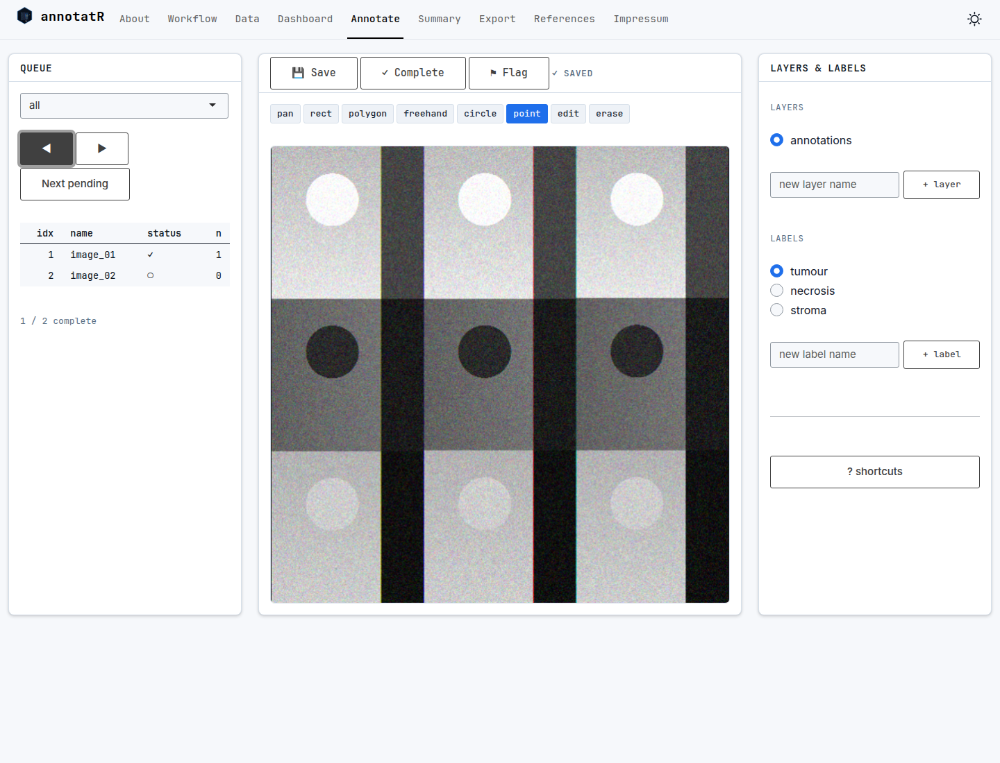

# T02 browser navigation qualification

Executed in headless Google Chrome for Testing 151.0.7922.34 (Playwright build directory chromium-1234) through Playwright against the actual Shiny app from the reviewed T02 source snapshot (the pre-T03 snapshot). Autosave was disabled. The local server listened only on 127.0.0.1:5933 and was stopped after verification.

The runner used actual tool/queue buttons, a canvas mouse click, and keyboard events. It synchronized on Shiny output state and DOM changes rather than fixed sleeps.

Sequence: select point → draw → next → previous → Ctrl+Z → Ctrl+Shift+Z → Shift+Enter.

Assertions passed:

- The point survives navigation with autosave disabled.
- Undo removes it and redo restores it on the original entry.
- Commit advances to an empty second entry.
- The queue shows image_01 complete with one ROI and image_02 pending with zero ROIs.
- No JavaScript page errors were reported.
- A separate R process read the actual saved session/project and confirmed those statuses/counts and the first project's matching entry_id.

Runner: `/tmp/annotatr-roadmap-t02-browser-journey.cjs`; application launcher: `/tmp/annotatr-roadmap-t02-browser-app.R`. These local diagnostic runners use environment-specific executable paths. T10/T11 supply portable browser regression runners and complete event/capability checks. This result does not qualify atomic disk replacement, browser stale-event envelopes, holes, multipolygons, or keyboard-only geometry creation.
